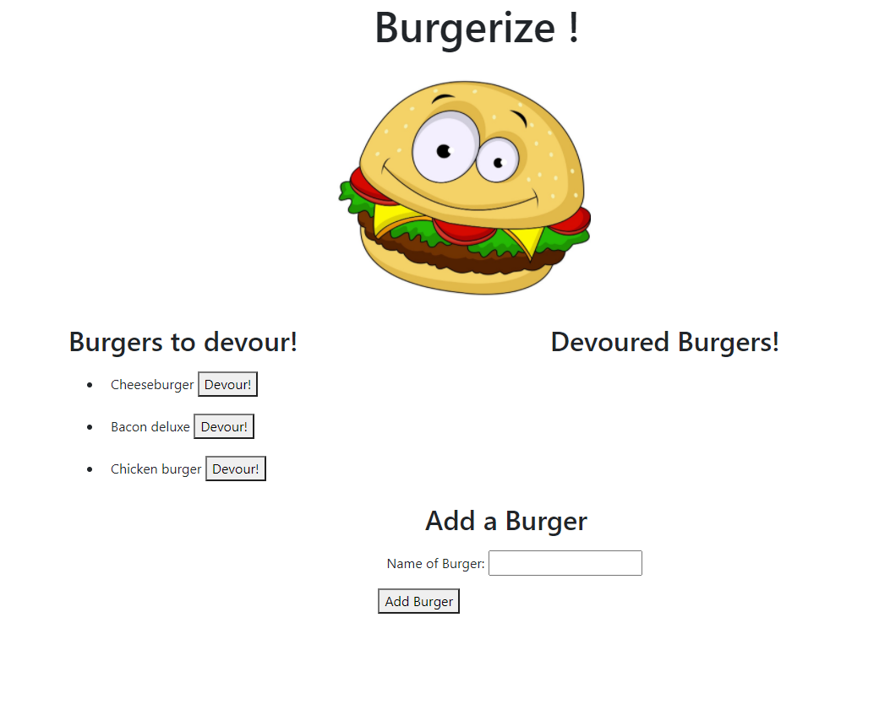

# Burgerize

## Description

Burgerize uses express-handlebars along with mySQL to highlight the tastiest burgers ever imaginable. Clicking the devour button in the burgers to devour section will move that burger into the devoured section. Furthermore, users can add another custom burger via the add a burger form, sending that burger to the ready to be devoured section.

## Table of Contents

- [Installation](#installation)

- [Contributing](#contributing)

- [Usage](#usage)

- [License](#license)

- [Questions?](#questions)

## Installation

Type npm install in the terminal with correct working directory

## Usage

type 'node server.js' in the terminal (make sure the terminal directory is the correct path)

## License

The licensing for this application is through: MIT

## Contributions

Contribution is welcome for all interested parties

## Questions?

GitHub: http://github.com/thomasmaglaris
Email: thomasmaglaris@gmail.com
